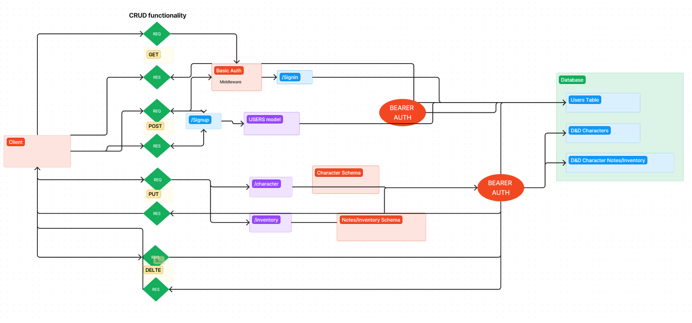

# LAB - Class 09

# Project: Lab 09 / D&D Back-end server

## Author: Nick Mullaney & Reece Renninger

### Problem Domain

Create a fully functioning API auth server with CRUD functionality that utilizes bearer/basic auth.

### Links and Resources

[GitHub Actions ci/cd](https://github.com/ReeceRenninger/lab09-PartnerProject)

[back-end server url](https://dandd-backend-project.onrender.com)

### Collaborators

### Setup

```javascript
PORT=<port-of-your-choice>
DATABASE_URL=postgres://localhost:5432/<your-db-name>
SECRET=<insert-secret-here>
```

How to initialize/run your application (where applicable)

    Clone repo down to local machine, set up envs to your liking, npm i, npm run init:config, npm run db:create

How to use your library (where applicable)
Features / Routes

  **ALL CRUD FUNCTIONS WILL BE ACCESSIBLE ONLY TO USERS WITH THE GIVEN PERMISSIONS**

    GET : /users, /inventory, /character - grab all characters, inventory, 
    POST : /users, /inventory, /character - create new users, characters, or inventory
    PUT : /inventory, /character - update characters or inventory
    DELETE : /users, /inventory, /character - delete users, character, or inventory

Tests

    No tests are currently implemented

UML

